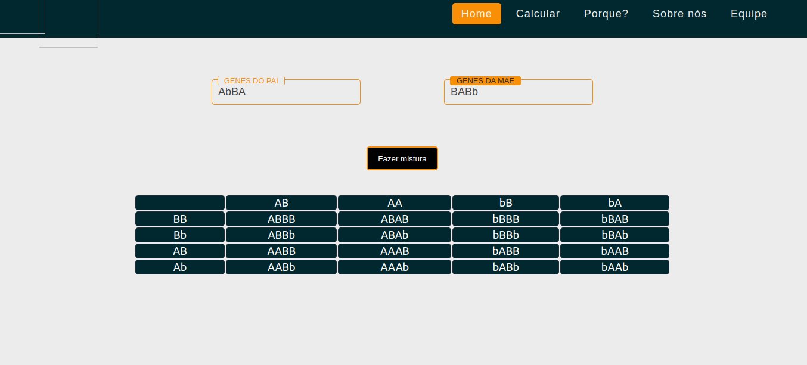

<h1 align="center"> :dna:Calculadora de Genes :dna:</h1>

<h2 align="center">Essa é uma calculadora que faz a mistura dos genes adicionados. </h2>

Logo abaixo uma Captura do Projeto

<h2 align="center"> Qual o intuito da criação desse projeto :question: </h2>

#### :dna: Esse é um  projeto feito com o intuito de ajudar e facilitar os calculos para as misturas dos genes!

<h2 align="center"> Quem desenvolveu esse projeto :question: </h2> 

#### :computer: O projeto em questão foi desenvolvido por quatro integrantes, que são, Saullo Paullo, eu (Laertes Angelo), Natan, e João Lucas Duarte! :computer:

 
  <h2  align="center"> Linguagens Utilizadas </h2>
  
  
 
  
  

